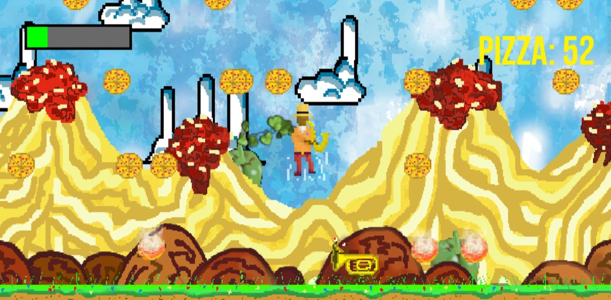

# Shake That Jazz

Spill i Python og Pygame fra 2023, med sprites jeg har tegnet selv og en butikk for oppgraderinger. Samle pizza, unngå tubaene og bruk pizzaen til å kjøpe oppgraderinger mellom rundene.



## Kontroller

| Tast | Handling |
|---|---|
| `Mellomrom` | Hopp |
| `A` / `←`, `D` / `→` | Gå til venstre og høyre |
| `R` | Start ny runde |
| Mus | Kjøp oppgraderinger mellom rundene: mer liv, lavere tyngdekraft og flere pizzaer |

## Kjør spillet

Krever Python 3 og Pygame. Kjør fra denne mappen, siden spillet laster bilder og lyd med relative stier.

```bash
pip install pygame
python Prosjekt.py
```

## Filer

- `Prosjekt.py` – spillet
- `spritesheetClass.py` – klasse som deler opp spritesheets til animasjoner
- `background/`, `jazzplayer/`, `pizza/`, `tuba/`, `spritesheets/` – grafikk
- `xcf/` – kildefilene til grafikken, tegnet i GIMP
- `UML-diagram Classes.eddx` – klassediagram (EdrawMax)
- `IT pygame prosjekt Shake That Jazz.odp` – presentasjon av prosjektet
